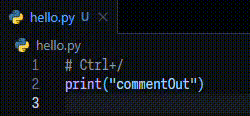
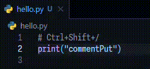

<h1 align="center">
commentPut - VScode extention
</h1>

<div align="center">

<div align="center">
  
  <span style="display: inline-block; margin-left: 4%; vertical-align: middle;">
    <strong>A simple alternative to Ctrl+/.</strong>
  </span>
</div>

<br/>

[](https://marketplace.visualstudio.com/items?itemName=asumo-1xts.commentput)
[](https://marketplace.visualstudio.com/items?itemName=asumo-1xts.commentput)
[](/LICENSE)

[](https://yarnpkg.com/)
[](https://github.com/asumo-1xts/vscode-commentput/actions/workflows/eslint.yml)
[](https://github.com/asumo-1xts/vscode-commentput/actions/workflows/prettier.yml)

|Normal commentOut|This extention: commentPut|
|:---:|:---:|
|||

Simply insert a comment prefix where the cursor is positioned.

55 major languages are supported by default.

</div>

## Getting started

See [Marketplace](https://marketplace.visualstudio.com/items?itemName=asumo-1xts.commentput) or search `commentput` from VScode.

Unless there are special circumstances, simply installing it is sufficient.

Just press `Ctrl+Shift+/` in your source files.

## Options

### Customize keybinding

The keybinding is `Ctrl+Shift+/` (or `Cmd+Shift+/`) by default.

You could assign it to an unused key on your keyboard.

`keybindings.json`

```jsonc
{
  "key": "ctrl+alt+/", // Use alt instead of shift
  "command": "commentput.insertPrefix",
  "when": "editorTextFocus"
}
```

### Modify or add your prefix

`settings.json`

```jsonc
{
  "commentput.languagePrefixes": {
    "c": "/* ", // Replace the default prefix
    "custom-language": "## " // Add otehr language's prefix
  }
}
```

The languages and prefix supported by default is [here](.config/languages.md).

If you would like support for a new language, please let us know via [Issues](https://github.com/asumo-1xts/vscode-commentput/issues).
